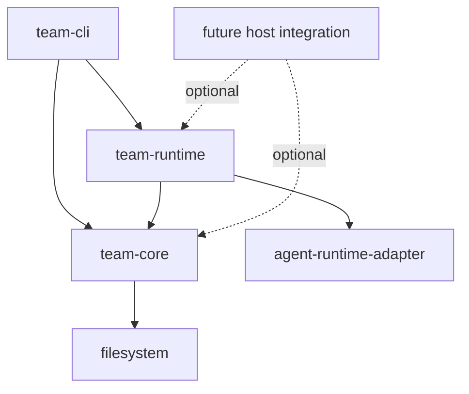
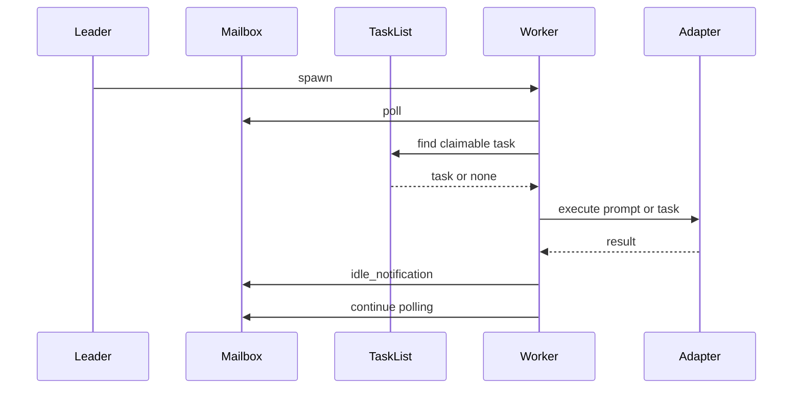

# Agent Team TRD

## 문서 개요

이 문서는 `agent-team` 프로젝트의 Technical Requirements Document다.

목적은 아래를 구현 가능한 수준으로 명시하는 것이다.

- 아키텍처
- 모듈 경계
- 저장 구조
- 메시지 프로토콜
- 런타임 lifecycle
- CLI 계약
- 구현 순서
- 테스트 전략

이 문서는 upstream 분석 결과와 현재 스캐폴드를 결합한
실행 가능한 기준 설계 문서다.

## 기술 목표

`agent-team`은 다음 기술 목표를 가진다.

1. upstream swarm 기능의 핵심만 독립 모듈로 추출한다.
2. `team-core`, `team-runtime`, `team-cli` 경계를 유지한다.
3. 파일 기반 저장소 위에서 안정적으로 동작한다.
4. 1차 구현은 `in-process` 전용으로 제한한다.
5. 향후 real agent runtime과 pane backend를 붙일 수 있게 설계한다.
6. **LLM 실행의 표준 경로는 `Codex CLI` 기반 runtime으로 두고, direct API integration은 금지한다.**

## upstream 기준 소스 맵

아래 파일들이 핵심 참고 대상이다.

| upstream 파일 | 핵심 역할 | agent-team 대응 |
|---|---|---|
| `utils/swarm/teamHelpers.ts` | 팀 파일 저장소, cleanup | `team-core/team-store.ts` |
| `utils/teammateMailbox.ts` | inbox + structured protocol | `team-core/mailbox-store.ts` |
| `utils/tasks.ts` | task list + claim + 상태 규칙 | `team-core/task-store.ts` |
| `utils/teammateContext.ts` | AsyncLocalStorage context | `team-runtime/context.ts` |
| `utils/swarm/spawnInProcess.ts` | in-process spawn | `team-runtime/spawn-in-process.ts` |
| `utils/swarm/inProcessRunner.ts` | teammate loop | `team-runtime/in-process-runner.ts` |
| `tools/shared/spawnMultiAgent.ts` | multi-backend spawn | 후순위 |
| `tools/AgentTool/runAgent.ts` | 실제 agent runtime loop | adapter 경계 |
| `tools/SendMessageTool/SendMessageTool.ts` | mailbox send + structured routes | `team-cli`, `team-runtime` |
| `main.tsx` | bootstrap/CLI identity contract | `team-cli` bootstrap |

## 현재 프로젝트 구조

```text
agent-team/
  docs/
  src/
    team-core/
    team-runtime/
    team-cli/
  tests/
  examples/
```

현재 상태:

- `team-core`는 lock-safe 저장소와 protocol이 구현됨
- `team-runtime`는 runner, local adapter, plan approval wait flow를 가짐
- `team-cli`는 headless 운영 명령 세트를 제공함
- direct upstream runtime bridge는 아직 후속 선택지로 남아 있음

## 모듈 경계



## 모듈별 책임

### `team-core`

책임:

- team file CRUD
- mailbox CRUD
- task list CRUD
- locking
- structured protocol parsing
- team cleanup
- path conventions
- shared types

절대 넣지 않을 것:

- React
- AppState
- tmux / iTerm pane management
- GrowthBook
- upstream REPL UI 의존성

### `team-runtime`

책임:

- runtime context
- teammate spawn
- teammate work loop
- mailbox poll
- task auto-claim
- idle / shutdown / plan approval handling
- adapter를 통한 실제 agent execution

### `team-cli`

책임:

- command parsing
- input validation
- 결과 출력
- core/runtime 호출 orchestration

비즈니스 로직은 최대한 여기 넣지 않는다.

## 강제 설계 결정

### 1. 저장 루트

- 기본: `~/.agent-team`
- override: `TeamCoreOptions.rootDir`

### 2. task list ID

- canonical rule: `sanitize(teamName)`

이 결정을 통해 아래 혼선을 제거한다.

- session ID 기반 fallback
- parentSessionId 기반 task lookup
- leader/worker 간 다른 task list 경로

### 3. owner 식별자

- canonical owner는 `agentId`
- 조회 호환성에서는 `agentName`도 읽을 수 있지만
  새로 쓰는 값은 `agentId`로 통일

### 4. backend 범위

- Phase 1 backend: `in-process`
- pane backend(`tmux`, `iTerm`)는 현재 공개 타입/구현 표면에서 제외

### 5. permission 흐름

- Phase 1은 simple mode
- real leader UI queue는 구현하지 않음
- mailbox 또는 adapter callback 중심으로 구성

### 6. LLM backend 정책

- primary / standard backend: `Codex CLI`
- allowed extension shape: CLI/subprocess bridge
- disallowed: OpenAI direct API, 기타 vendor direct API
- 즉, runtime adapter는 **CLI 기반 agent runtime bridge**를 전제로 설계한다.

## 파일 저장 구조

```text
~/.agent-team/
  teams/
    <sanitized-team>/
      config.json
      inboxes/
        <sanitized-agent>.json
      permissions/
        pending/
        resolved/
  tasks/
    <sanitized-team>/
      .lock
      .highwatermark
      1.json
      2.json
```

## 핵심 데이터 모델

### TeamFile

최소 필드:

- `name`
- `description?`
- `createdAt`
- `leadAgentId`
- `leadSessionId?`
- `hiddenPaneIds?`
- `teamAllowedPaths?`
- `members[]`

### TeamMember

최소 필드:

- `agentId`
- `name`
- `agentType?`
- `model?`
- `color?`
- `joinedAt`
- `cwd`
- `subscriptions`
- `worktreePath?`
- `sessionId?`
- `backendType?`
- `isActive?`
- `mode?`

### TeamTask

최소 필드:

- `id`
- `subject`
- `description`
- `activeForm?`
- `owner?`
- `status`
- `blocks[]`
- `blockedBy[]`
- `metadata?`

status enum:

- `pending`
- `in_progress`
- `completed`

### TeammateMessage

기본 필드:

- `from`
- `text`
- `timestamp`
- `read`
- `color?`
- `summary?`

## structured mailbox protocol

Phase 1에서 반드시 구현할 메시지 타입:

### 1. `idle_notification`

목적:

- teammate가 idle 상태 또는 완료 상태로 전환됐음을 leader에게 알림

필드:

- `type`
- `from`
- `timestamp`
- `idleReason?`
- `summary?`
- `completedTaskId?`
- `completedStatus?`
- `failureReason?`

### 2. `shutdown_request`

목적:

- leader가 teammate에게 종료 의사를 전달

필드:

- `type`
- `requestId`
- `from`
- `reason?`
- `timestamp`

### 3. `shutdown_approved`

목적:

- teammate가 종료 승인 응답

필드:

- `type`
- `requestId`
- `from`
- `timestamp`
- `paneId?`
- `backendType?`

### 4. `shutdown_rejected`

목적:

- teammate가 종료 거절 응답

필드:

- `type`
- `requestId`
- `from`
- `reason`
- `timestamp`

### 5. `plan_approval_request`

목적:

- plan mode teammate가 leader에게 plan approval 요청

필드:

- `type`
- `from`
- `timestamp`
- `planFilePath`
- `planContent`
- `requestId`

### 6. `plan_approval_response`

목적:

- leader가 계획 승인 또는 거절

필드:

- `type`
- `requestId`
- `approved`
- `feedback?`
- `timestamp`
- `permissionMode?`

후순위 프로토콜:

- `permission_request`
- `permission_response`
- `sandbox_permission_request`
- `sandbox_permission_response`
- `team_permission_update`
- `mode_set_request`
- `task_assignment`

## locking 전략

### 요구사항

- mailbox append는 경쟁 조건 없이 안전해야 함
- task create/update/claim/delete는 경쟁 조건 없이 안전해야 함
- mark-as-read도 동일하게 안전해야 함

### 권장 방식

- `proper-lockfile` 사용
- 대상 file이 없으면 생성 후 lock
- task list 레벨 lock과 task file 레벨 lock을 분리

### lock 대상

- inbox file
- inbox file lock sidecar
- task list `.lock`
- task file 단위 lock

### 구현 위치

- `src/team-core/lockfile.ts`
- `src/team-core/mailbox-store.ts`
- `src/team-core/task-store.ts`

## task list 설계

### high water mark

필요 이유:

- task 삭제 후 ID 재사용 방지

파일:

- `.highwatermark`

### createTask

동작:

1. task list lock 획득
2. highest id 읽기
3. 새 id 할당
4. task file 기록
5. lock 해제

### updateTask

동작:

1. task 존재 확인
2. task file lock 획득
3. 현재 task 재조회
4. merge update
5. 저장

### deleteTask

동작:

1. high water mark 업데이트
2. task file 삭제
3. 다른 task의 `blocks`, `blockedBy` 정리

### blockTask

동작:

- A blocks B
- A.blocks += B
- B.blockedBy += A

### claimTask

반드시 구현해야 하는 검증:

- task 존재 여부
- 이미 다른 owner가 claim했는지
- completed 상태인지
- unresolved blocker 존재 여부
- optional busy check 여부

출력:

- `success`
- `reason`
- `task`
- `busyWithTasks?`
- `blockedByTasks?`

### unassignTeammateTasks

shutdown 또는 abort 시 필요하다.

동작:

- unresolved assigned task 조회
- owner 제거
- status를 `pending`으로 리셋
- notification payload 생성

### getAgentStatuses

목적:

- 팀원별 idle/busy 상태 계산

규칙:

- unresolved task를 하나 이상 소유하면 `busy`
- 아니면 `idle`

## team store 설계

### 필수 API

- `readTeamFile`
- `writeTeamFile`
- `createTeam`
- `listTeamMembers`
- `upsertTeamMember`
- `removeTeamMember`
- `setMemberActive`
- `setMemberMode`
- `cleanupTeamDirectories`

### cleanup

Phase 1에서 team delete 전체 명령이 없어도 아래는 있어야 한다.

- team directory 삭제
- tasks directory 삭제
- permissions directory 삭제

pane kill이나 git worktree cleanup은 Phase 2로 미룬다.

## mailbox store 설계

### 필수 API

- `readMailbox`
- `readUnreadMessages`
- `writeToMailbox`
- `markMessageAsReadByIndex`
- `markMessagesAsRead`
- `markMessagesAsReadByPredicate`
- `clearMailbox`

### protocol helper API

- `isShutdownRequest`
- `isShutdownApproved`
- `isShutdownRejected`
- `isPlanApprovalRequest`
- `isPlanApprovalResponse`
- `isIdleNotification`
- `isStructuredProtocolMessage`

### 우선순위 규칙

runtime loop에서 메시지는 아래 우선순위로 소비한다.

1. shutdown request
2. team leader message
3. unread 일반 message
4. task polling fallback

## runtime 설계

### `team-runtime/context.ts`

역할:

- AsyncLocalStorage 기반 teammate context 제공

필드:

- `agentId`
- `agentName`
- `teamName`
- `color?`
- `planModeRequired`
- `abortController`

### `team-runtime/runtime-adapter.ts`

역할:

- 실제 agent execution runtime을 추상화

필수 인터페이스:

- `startTeammate(config, context): Promise<RuntimeSpawnResult>`

Phase 1:

- noop adapter + mock adapter + local runtime adapter 지원
- `RuntimeTurnBridge` 계약으로 work item 실행을 추상화
- `RuntimeTeammateHandle.join()`으로 background loop 완료 대기 지원

Phase 2:

- upstream `runAgent()` bridge adapter 도입

### `team-runtime/spawn-in-process.ts`

필수 동작:

1. 팀 존재 확인
2. `agentId = name@teamName` 계산
3. runtime context 생성
4. 팀 멤버 upsert
5. adapter 실행
6. stop handle 반환

누락 보완 필요:

- start 이후 background loop 연결
- stop 시 active 상태 false 반영

### `team-runtime/in-process-runner.ts`

새로 만들어야 하는 핵심 파일이다.

필수 기능:

- mailbox poll loop
- next prompt resolution
- task auto-claim
- structured protocol 처리
- idle state 전이
- shutdown 승인 여부 처리
- task unassign on stop/failure
- adapter turn execution orchestration

## runtime loop 상세



### wait loop 규칙

1. pending in-memory user message가 있으면 우선 처리
2. unread mailbox에서 shutdown request를 먼저 찾음
3. leader message를 peer message보다 우선 처리
4. 아무 메시지도 없으면 task list에서 claim 가능 task를 탐색
5. 그래도 없으면 sleep 후 반복

### idle notification 규칙

idle 전환 시 leader에게 `idle_notification` 전송.

포함 가능한 상태:

- available
- interrupted
- failed

### shutdown 규칙

shutdown request를 받으면:

1. request를 runtime에 전달
2. teammate가 approve/reject 응답
3. approve면 stop handle 또는 abort controller 실행
4. unresolved task 정리

### plan approval 규칙

`planModeRequired = true`인 teammate는 구현 전 계획 승인을 요청할 수 있어야 한다.

Phase 1 구현 방식:

- teammate가 `plan_approval_request` 전송
- leader가 CLI에서 승인/거절
- response를 mailbox로 전송

## CLI 설계

### 최소 명령 세트

- `agent-team init <team-name>`
- `agent-team spawn <team-name> <agent-name> --prompt "..."`
- `agent-team send <team-name> <recipient> <message>`
- `agent-team tasks <team-name>`
- `agent-team task-create <team-name> <subject> --description "..."`
- `agent-team task-update <team-name> <task-id> --status in_progress`
- `agent-team shutdown <team-name> <agent-name>`
- `agent-team approve-plan <team-name> <agent-name> <request-id>`
- `agent-team reject-plan <team-name> <agent-name> <request-id> --feedback "..."`
- `agent-team status <team-name>`

### bootstrap identity 계약

standalone에서는 upstream의 복잡한 동적 bootstrap 대신
아래 규칙으로 고정한다.

- leader는 CLI command caller
- teammate identity는 spawn config로 생성
- resume은 Phase 2

추후 필요시 추가할 옵션:

- `--agent-id`
- `--agent-name`
- `--team-name`
- `--plan-mode-required`
- `--parent-session-id`

## 테스트 전략

### team-core unit tests

테스트 대상:

- path sanitize
- team create / read / upsert / remove
- mailbox append / read / mark-as-read
- structured protocol parsing
- task create / update / delete
- claimTask rules
- unassignTeammateTasks
- getAgentStatuses

### concurrency tests

테스트 대상:

- 동시에 inbox write 2개 이상
- 동시에 task create 2개 이상
- 동시에 same task claim 시 단일 owner 보장

### team-runtime tests

테스트 대상:

- spawn success
- task polling
- mailbox priority handling
- idle notification
- shutdown approve / reject
- plan approval request / response

### CLI smoke tests

테스트 대상:

- `init`
- `send`
- `tasks`
- `spawn`
- `shutdown`

## 의존성 요구사항

### 필수

- `typescript`
- `@types/node`
- `proper-lockfile`

### 권장

- `zod`
- 테스트 러너 한 가지

추천:

- `vitest` 또는 `node:test`

## 구현 순서

## Phase 1. team-core 완성

구현 파일:

- `src/team-core/lockfile.ts`
- `src/team-core/types.ts`
- `src/team-core/team-store.ts`
- `src/team-core/mailbox-store.ts`
- `src/team-core/task-store.ts`

할 일:

- 락 추가
- structured protocol 추가
- claim / block / unassign / status 추가
- cleanup 추가

## Phase 2. team-runtime 실동작 구현

구현 파일:

- `src/team-runtime/in-process-runner.ts`
- `src/team-runtime/spawn-in-process.ts`
- `src/team-runtime/runtime-adapter.ts`
- `src/team-runtime/context.ts`

할 일:

- polling loop
- task auto-claim
- mailbox priority
- shutdown / idle / plan approval 처리

## Phase 3. CLI 완성

구현 파일:

- `src/team-cli/run-cli.ts`
- `src/team-cli/commands/*`

할 일:

- spawn
- status
- task create/update
- approval commands

## Phase 4. real runtime adapter

선택지:

- standalone adapter 작성
- upstream `runAgent()`와 bridge

권장:

- 먼저 adapter contract 고정
- Phase 1에서는 local equivalent bridge를 구현
- 이후 direct upstream bridge는 별도 단계에서 구현

## 구현 시 주의점

### 1. upstream 결합 재유입 방지

`team-core`에 AppState 개념을 다시 넣지 않는다.

### 2. plain text와 structured message를 혼동하지 않기

inbox는 모든 메시지를 담을 수 있지만,
structured protocol은 parse helper로 분리해야 한다.

### 3. cleanup을 미루지 않기

task unassign과 team cleanup이 빠지면 상태가 금방 오염된다.

### 4. owner 식별자를 흔들지 않기

새로 쓰는 owner는 반드시 `agentId`.

### 5. taskListId 규칙을 중간에 바꾸지 않기

`sanitize(teamName)`를 고정한다.

## 구현 완료 정의

아래를 만족하면 Phase 1 기술 구현 완료로 본다.

1. `team-core` 모든 저장소 연산이 lock-safe 하다.
2. structured mailbox protocol 최소 세트가 동작한다.
3. teammate가 task를 claim하고 완료 후 idle notification을 보낸다.
4. shutdown / plan approval 흐름이 CLI만으로 검증 가능하다.
5. 코드가 UI 없이 테스트 가능하다.

## 정리

`agent-team`의 핵심 기술 과제는
upstream 기능을 그대로 복붙하는 것이 아니라,
`저장소 규칙`, `프로토콜`, `런타임 루프`, `어댑터 경계`를
독립 시스템으로 다시 정리하는 것이다.

가장 먼저 완성해야 하는 것은 `team-core`이며,
그 다음이 `in-process runtime loop`, 그 다음이 `CLI`, 마지막이 real runtime bridge다.
