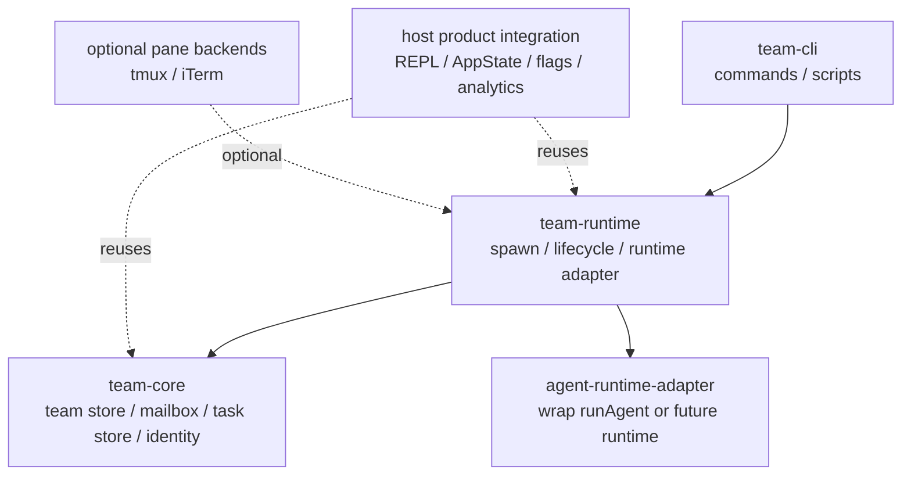

# Agent Team Module Boundary

## 개요

`agent-team`은 기존 제품 코드에서 에이전트 팀 기능을 떼어내되,
모든 UI와 터미널 백엔드를 한 번에 옮기지 않는 방향을 기준으로 한다.

1차 목표는 `team-core`를 먼저 분리하고,
그 위에 `team-runtime`, `team-cli`를 쌓을 수 있는 경계를 만드는 것이다.

## 권장 모듈 경계도



## 모듈별 책임

| 모듈 | 책임 | 허용 의존성 | 1차 제외 |
|---|---|---|---|
| `team-core` | 팀 파일, mailbox, task list, 경로 규칙, 기본 타입 | Node fs/path 정도의 저수준 의존성 | React, AppState, tmux, GrowthBook |
| `team-runtime` | teammate spawn, lifecycle, message dispatch, runtime adapter | `team-core`, agent runtime adapter | REPL UI, pane layout UI |
| `team-cli` | init, spawn, send, tasks, status 같은 사용자 진입점 | `team-core`, `team-runtime` | 제품 내부 bootstrap |
| `host integration` | 기존 제품과 연결되는 브리지 | 기존 제품의 상태, 플래그, telemetry | 독립 모듈의 핵심 로직 |

## 경계 원칙

### 1. `team-core`는 제품 독립적이어야 한다

다음 의존성은 `team-core`로 가져오지 않는다.

- `AppState`
- React 컴포넌트
- `main.tsx`
- GrowthBook 및 제품 실험 플래그
- tmux / iTerm pane 제어

`team-core`는 파일 저장소와 타입, 그리고 순수한 도메인 로직만 가진다.

### 2. `team-runtime`은 실행만 담당한다

`team-runtime`은 teammate를 띄우고 종료하고 메시지를 흘려보내는 계층이다.
여기서는 `runAgent()` 같은 기존 런타임을 어댑터로 감싸는 방식이 적합하다.

### 3. `team-cli`는 가장 얇게 유지한다

CLI는 `team-core`와 `team-runtime` API를 호출하는 래퍼 역할만 맡는다.
비즈니스 로직이 다시 CLI로 흘러들어가지 않게 한다.

## 1차 추출 경계

### 바로 이동할 대상

- 팀 파일 저장소
- teammate mailbox
- shared task list 저장소
- 경로 규칙과 sanitize 함수
- 팀/태스크/메시지 타입

### 어댑터로 감쌀 대상

- in-process teammate context
- in-process spawn
- in-process runner
- tool 기반 API 레이어
- team context prompt 주입

### 당장 남겨둘 대상

- REPL UI
- task 패널과 teammates dialog
- tmux / iTerm pane backend
- analytics / feature flag

## 1차 디렉토리 제안

```text
agent-team/
  docs/
  src/
    team-core/
      index.ts
      types.ts
      paths.ts
      team-store.ts
      mailbox-store.ts
      task-store.ts
    team-runtime/
    team-cli/
```

## 정리

가장 중요한 경계는 아래 한 줄로 정리된다.

`team-core`는 저장소와 규칙만, `team-runtime`은 실행만, `team-cli`는 진입점만 가진다.
